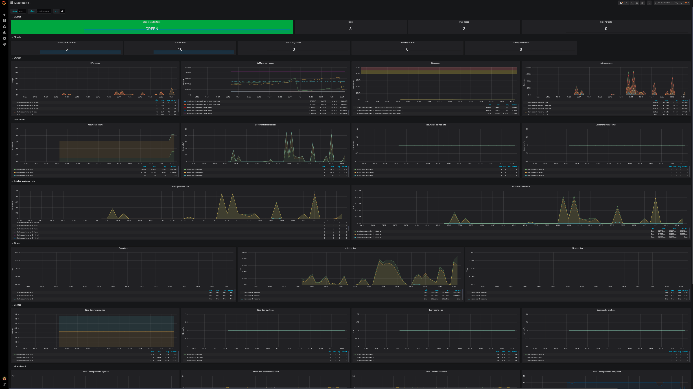
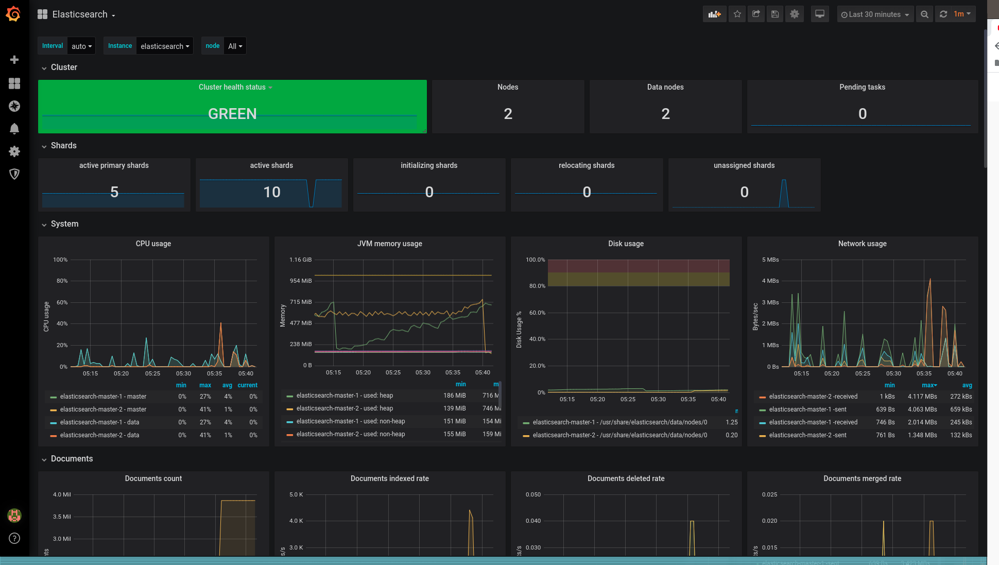
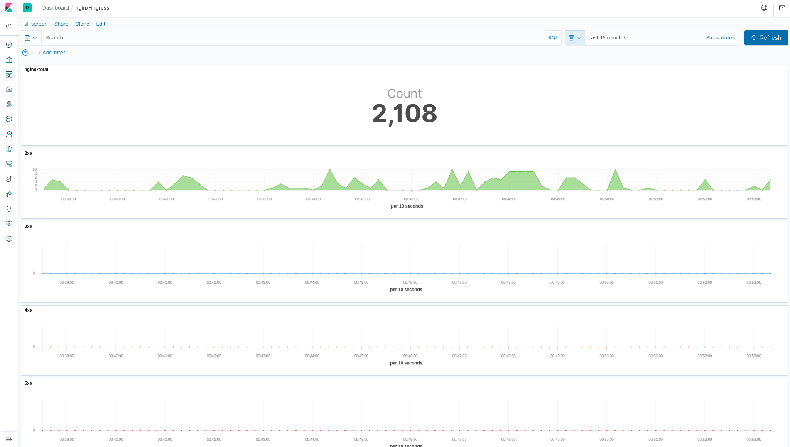

# Выполнено ДЗ № 9

Создание кластера по заданным параметрам

```bash
gcloud beta container --project "otus-logging" clusters create "cluster" --zone "europe-west2-b" --no-enable-basic-auth --cluster-version "1.14.10-gke.27" --machine-type "n1-standard-2" --image-type "COS" --disk-type "pd-standard" --disk-size "100" --metadata disable-legacy-endpoints=true --scopes "https://www.googleapis.com/auth/devstorage.read_only","https://www.googleapis.com/auth/logging.write","https://www.googleapis.com/auth/monitoring","https://www.googleapis.com/auth/servicecontrol","https://www.googleapis.com/auth/service.management.readonly","https://www.googleapis.com/auth/trace.append" --num-nodes "1" --no-enable-stackdriver-kubernetes --enable-ip-alias --network "projects/otus-logging/global/networks/default" --subnetwork "projects/otus-logging/regions/europe-west2/subnetworks/default" --default-max-pods-per-node "110" --no-enable-master-authorized-networks --addons HorizontalPodAutoscaling,HttpLoadBalancing --no-enable-autoupgrade --no-enable-autorepair && gcloud beta container --project "otus-logging" node-pools create "infra-pool" --cluster "cluster" --zone "europe-west2-b" --node-version "1.14.10-gke.27" --machine-type "n1-standard-2" --image-type "COS" --disk-type "pd-standard" --disk-size "100" --metadata disable-legacy-endpoints=true --node-taints node-role=infra:NoSchedule --scopes "https://www.googleapis.com/auth/devstorage.read_only","https://www.googleapis.com/auth/logging.write","https://www.googleapis.com/auth/monitoring","https://www.googleapis.com/auth/servicecontrol","https://www.googleapis.com/auth/service.management.readonly","https://www.googleapis.com/auth/trace.append" --num-nodes "3" --no-enable-autoupgrade --no-enable-autorepair

```

```bash
kubectl get nodes
NAME                                     STATUS   ROLES    AGE     VERSION
gke-cluster-default-pool-2ace0c47-vtsj   Ready    <none>   5m2s    v1.14.10-gke.27
gke-cluster-infra-pool-0b752724-9x98     Ready    <none>   4m12s   v1.14.10-gke.27
gke-cluster-infra-pool-0b752724-nf8b     Ready    <none>   4m11s   v1.14.10-gke.27
gke-cluster-infra-pool-0b752724-x6h6     Ready    <none>   4m11s   v1.14.10-gke.27
```

Воспользуемся hipster-stop создадим ему namespace и установим его

```bash
kubectl create ns microservices-demo && kubectl apply -f https://raw.githubusercontent.com/express42/otus-platform-snippets/master/Module-02/Logging/microservices-demo-without-resources.yaml -n microservices-demo

namespace/microservices-demo created
deployment.apps/emailservice created
service/emailservice created
deployment.apps/checkoutservice created
service/checkoutservice created
deployment.apps/recommendationservice created
service/recommendationservice created
deployment.apps/frontend created
service/frontend created
service/frontend-external created
deployment.apps/paymentservice created
service/paymentservice created
deployment.apps/productcatalogservice created
service/productcatalogservice created
deployment.apps/cartservice created
service/cartservice created
deployment.apps/loadgenerator created
deployment.apps/currencyservice created
service/currencyservice created
deployment.apps/shippingservice created
service/shippingservice created
deployment.apps/redis-cart created
service/redis-cart created
deployment.apps/adservice created
service/adservice created
```

проверка что все ноды развернулись на default-pool

```bash
kubectl get pods -n microservices-demo -o wide
NAME                                     READY   STATUS    RESTARTS   AGE     IP           NODE                                     NOMINATED NODE   READINESS GATES
adservice-6898984d4c-7bvcn               1/1     Running   0          2m50s   10.24.0.19   gke-cluster-default-pool-2ace0c47-vtsj   <none>           <none>
cartservice-86854d9586-vcppk             1/1     Running   2          2m52s   10.24.0.14   gke-cluster-default-pool-2ace0c47-vtsj   <none>           <none>
checkoutservice-85597d98b5-wvrcg         1/1     Running   0          2m54s   10.24.0.9    gke-cluster-default-pool-2ace0c47-vtsj   <none>           <none>
currencyservice-c97fb88c9-gfgzn          1/1     Running   0          2m52s   10.24.0.15   gke-cluster-default-pool-2ace0c47-vtsj   <none>           <none>
emailservice-c6958d989-dp578             1/1     Running   0          2m55s   10.24.0.8    gke-cluster-default-pool-2ace0c47-vtsj   <none>           <none>
frontend-756f85785-cg2nm                 1/1     Running   0          2m54s   10.24.0.11   gke-cluster-default-pool-2ace0c47-vtsj   <none>           <none>
loadgenerator-755dcf9f5d-l5x7p           1/1     Running   4          2m52s   10.24.0.17   gke-cluster-default-pool-2ace0c47-vtsj   <none>           <none>
paymentservice-66fbfd9d8f-trcz2          1/1     Running   0          2m53s   10.24.0.13   gke-cluster-default-pool-2ace0c47-vtsj   <none>           <none>
productcatalogservice-78694d9b67-b22ng   1/1     Running   0          2m53s   10.24.0.12   gke-cluster-default-pool-2ace0c47-vtsj   <none>           <none>
recommendationservice-948bbf47c-s9525    1/1     Running   0          2m54s   10.24.0.10   gke-cluster-default-pool-2ace0c47-vtsj   <none>           <none>
redis-cart-6cf575c898-jhqhw              1/1     Running   0          2m51s   10.24.0.18   gke-cluster-default-pool-2ace0c47-vtsj   <none>           <none>
shippingservice-7fc8b8d49f-b8s58         1/1     Running   0          2m51s   10.24.0.16   gke-cluster-default-pool-2ace0c47-vtsj   <none>           <none>
```

## Добавим Helm repo ELK и начнем установку

```bash
helm repo add elastic https://helm.elastic.co
"elastic" has been added to your repositories
```

Установим нужные нам компоненты

```bash
kubectl create ns observability
helm upgrade --install elasticsearch elastic/elasticsearch --namespace observability && helm upgrade --install kibana elastic/kibana --namespace observability && helm upgrade --install fluent-bit stable/fluent-bit --namespace observability
```

По техзаданию разместим на infra нодах

```bash
helm upgrade --install elasticsearch elastic/elasticsearch --namespace observability -f elasticsearch.values.yaml
```

Проверка корректности установки Elasticsearch на infra-pool

```bash
kubectl get pods -n observability -o wide -l chart=elasticsearch
NAME                     READY   STATUS    RESTARTS   AGE     IP          NODE                                   NOMINATED NODE   READINESS GATES
elasticsearch-master-0   1/1     Running   0          3m52s   10.24.1.3   gke-cluster-infra-pool-0b752724-9x98   <none>           <none>
elasticsearch-master-1   1/1     Running   0          3m52s   10.24.2.2   gke-cluster-infra-pool-0b752724-x6h6   <none>           <none>
elasticsearch-master-2   1/1     Running   0          3m52s   10.24.3.2   gke-cluster-infra-pool-0b752724-nf8b   <none>           <none>
```

## Добавим helm nginx-ingress. Создадим namespace и установим nginx-ingress

```bash

helm repo add stable https://kubernetes-charts.storage.googleapis.com

kubectl create ns nginx-ingress

helm upgrade --install nginx-ingress stable/nginx-ingress  --namespace=nginx-ingress -f nginx-ingress.values.yaml

```

Узнаем EXTERNAL-IP

```bash
kubectl --namespace nginx-ingress get services -o wide nginx-ingress-controller

NAME                       TYPE           CLUSTER-IP    EXTERNAL-IP    PORT(S)                      AGE    SELECTOR
nginx-ingress-controller   LoadBalancer   10.28.3.205   34.89.73.112   80:30269/TCP,443:30053/TCP   119s   app.kubernetes.io/component=controller,app=nginx-ingress,release=nginx-ingress
```

Обновим релиз Kibana

```bash
helm upgrade --install kibana elastic/kibana --namespace observability -f kibana.values.yaml
```

Заметим, что в ElasticSearch логи не все . Посмотрим что делает fluent-bit

```bash
kubectl logs fluent-bit-5ccdl -n observability --tail 2
[2020/04/11 18:02:49] [error] [out_fw] no upstream connections available
[2020/04/11 18:02:49] [ warn] [engine] failed to flush chunk '1-1586626612.55210092.flb', retry in 568 seconds: task_id=18, input=tail.0 > output=forward.0
```

Пропишем правила для корректной работы, в это разделе сразу опишу что могут быть повторения полей для этого присвоим значение time_key, "лечение" от этого по ссылке <https://kubernetes.io/docs/concepts/configuration/taint-and-toleration/>

```bash
helm upgrade --install fluent-bit stable/fluent-bit --namespace observability  -f fluent-bit.values.yaml
```

## Мониторин Elasticseach

Установка helm chart`a prometheus-operator и elasticsearch-exporter

```bash
helm upgrade --install prometheus stable/prometheus-operator --namespace=observability -f prometheus-operator.values.yaml
helm upgrade --install elasticsearch-exporter stable/elasticsearch-exporter \
--set es.uri=http://elasticsearch-master:9200 \
--set serviceMonitor.enabled=true \
--namespace=observability
```

Пробросим порт и смотрим результат

```bash
grafana.34.89.73.112.xip.io
```



Попробуем убрать одну ноду, затем еще одну. Первая попытка была успешна, вторая не принесла результата так как Disruption Budget не дает это сделать (<https://kubernetes.io/docs/tasks/run-application/configure-pdb/>).

```bash
kubectl drain gke-cluster-infra-pool-0b752724-x6h6 --ignore-daemonsets

node/gke-cluster-infra-pool-0b752724-x6h6 cordoned
evicting pod "nginx-ingress-controller-df7cbc4c7-6zvq4"
evicting pod "elasticsearch-master-1"
pod/elasticsearch-master-1 evicted
pod/nginx-ingress-controller-df7cbc4c7-6zvq4 evicted
node/gke-cluster-infra-pool-0b752724-x6h6 evicted

kubectl get nodes

NAME                                     STATUS                     ROLES    AGE   VERSION
gke-cluster-default-pool-2ace0c47-vtsj   Ready                      <none>   22h   v1.14.10-gke.27
gke-cluster-infra-pool-0b752724-9x98     Ready                      <none>   22h   v1.14.10-gke.27
gke-cluster-infra-pool-0b752724-nf8b     Ready                      <none>   22h   v1.14.10-gke.27
gke-cluster-infra-pool-0b752724-x6h6     Ready,SchedulingDisabled   <none>   22h   v1.14.10-gke.27

kubectl drain gke-cluster-infra-pool-0b752724-nf8b --ignore-daemonsets

node/gke-cluster-infra-pool-0b752724-nf8b cordoned
evicting pod "nginx-ingress-controller-df7cbc4c7-fv7v5"
evicting pod "elasticsearch-master-2"
error when evicting pod "elasticsearch-master-2" (will retry after 5s): Cannot evict pod as it would violate the pod's disruption budget.
evicting pod "elasticsearch-master-2"
error when evicting pod "elasticsearch-master-2" (will retry after 5s): Cannot evict pod as it would violate the pod's disruption budget.
evicting pod "elasticsearch-master-2"
error when evicting pod "elasticsearch-master-2" (will retry after 5s): Cannot evict pod as it would violate the pod's disruption budget.
evicting pod "elasticsearch-master-2"
error when evicting pod "elasticsearch-master-2" (will retry after 5s): Cannot evict pod as it would violate the pod's disruption budget.
evicting pod "elasticsearch-master-2"
error when evicting pod "elasticsearch-master-2" (will retry after 5s): Cannot evict pod as it would violate the pod's disruption budget.
pod/nginx-ingress-controller-df7cbc4c7-fv7v5 evicted
evicting pod "elasticsearch-master-2"
```



Вернем на место все ноды

```bash
kubectl uncordon gke-cluster-infra-pool-0b752724-nf8b gke-cluster-infra-pool-0b752724-nf8b

node/gke-cluster-infra-pool-0b752724-nf8b uncordoned
node/gke-cluster-infra-pool-0b752724-nf8b uncordoned

```

Получим логи от nginx и приведем в соотвествии с требованиями для этого добавим опцию log-format-escape-json и log-format-upstream

Добавим визуализацию в kibana и экспортируем в файл export.ndjson



## LOKI

Установка loki и Promtail

```bash
helm repo add loki https://grafana.github.io/loki/charts

helm upgrade --install loki --namespace=observability loki/loki
helm upgrade --install promtail loki/promtail --set "loki.serviceName=loki" --namespace=observability -f loki.promtail.values.yaml
```

Создадим новый дашборд
Удастоверимся nginx-ingress устанавливается serviceMonitor, и Prometheus "видит" его, добавим переменные
итоговый результат в файле nginx-ingress.json

## PR checklist

- [x] Выставлен label с номером домашнего задания
- [x] Задание со *
