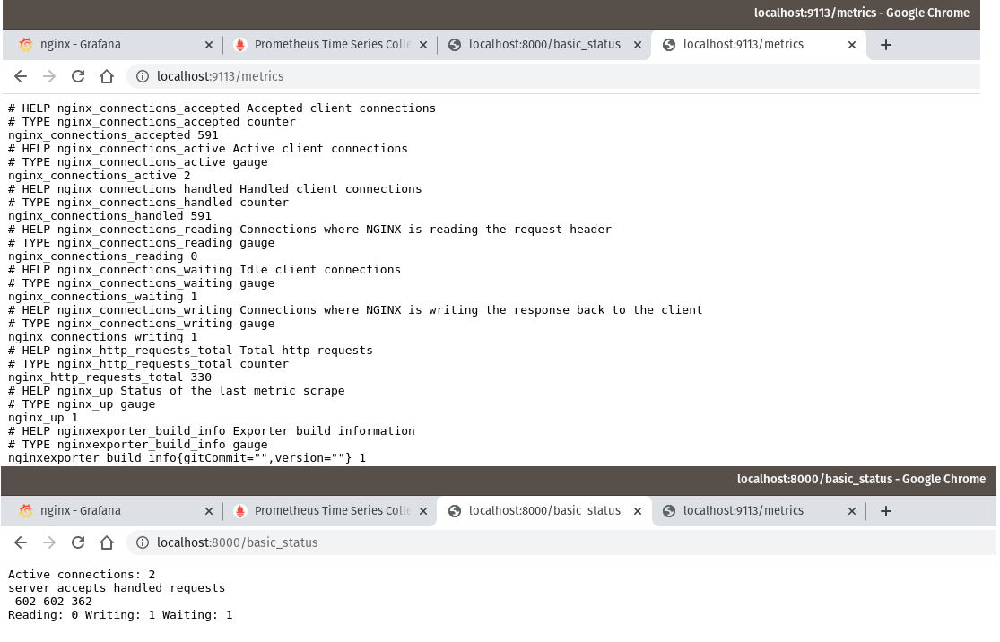
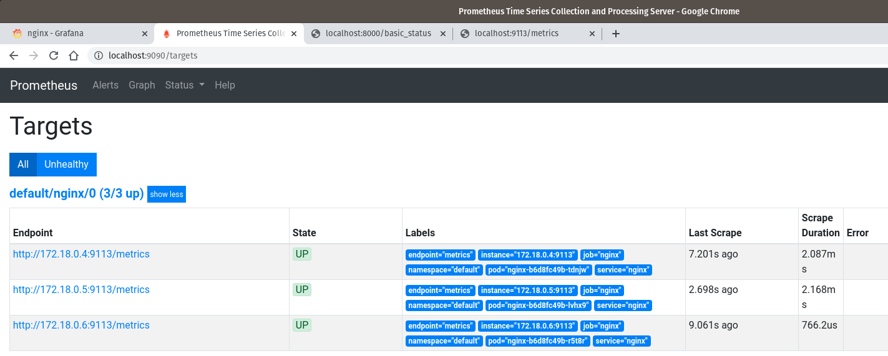
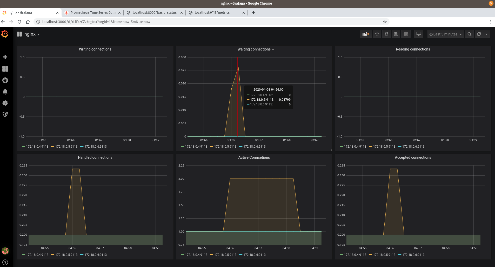

# Выполнено ДЗ № 8

Поднимем minikube

v 1.19

Применим deployment с nginx, service и servicemonitor

```bash
kubectl apply -f deployment.yaml --validate && kubectl apply -f service.yaml --validate && kubectl apply -f servicemonitor.yaml --validate
```

Создано namespace для prometheus

```bash
kubectl apply -f ns.yaml
```

Установим CRD для корректной работы

```bash
kubectl apply -f https://raw.githubusercontent.com/coreos/prometheus-operator/release-0.35/example/prometheus-operator-crd/monitoring.coreos.com_alertmanagers.yaml && kubectl apply -f https://raw.githubusercontent.com/coreos/prometheus-operator/release-0.35/example/prometheus-operator-crd/monitoring.coreos.com_podmonitors.yaml && kubectl apply -f https://raw.githubusercontent.com/coreos/prometheus-operator/release-0.35/example/prometheus-operator-crd/monitoring.coreos.com_prometheuses.yaml && kubectl apply -f https://raw.githubusercontent.com/coreos/prometheus-operator/release-0.35/example/prometheus-operator-crd/monitoring.coreos.com_prometheusrules.yaml && kubectl apply -f https://raw.githubusercontent.com/coreos/prometheus-operator/release-0.35/example/prometheus-operator-crd/monitoring.coreos.com_servicemonitors.yaml
```

Установка helm chart`a prometheus-operator

```bash
helm upgrade --install prometheus stable/prometheus-operator --namespace=prometheus -f values.yaml
```

Узнать пароль от grafana

```bash
kubectl get secret --namespace prometheus prometheus-grafana -o jsonpath="{.data.admin-password}" | base64 --decode ; echo
```

Пробросим nginx, prometheus, grafana

```bash
kubectl port-forward nginx-XXXXXXXX-XXXXX 9113:9113 8000:8000
kubectl port-forward -n prometheus prometheus-prometheus-prometheus-oper-prometheus-0 9090:9090
kubectl port-forward -n prometheus prometheus-grafana-7977c8cff-xt9wp 3000:3000
```

На скринах показано метрики, цели, дашборд графаны.







## PR checklist

- [x] Выставлен label с номером домашнего задания
- [x] Задание со *
